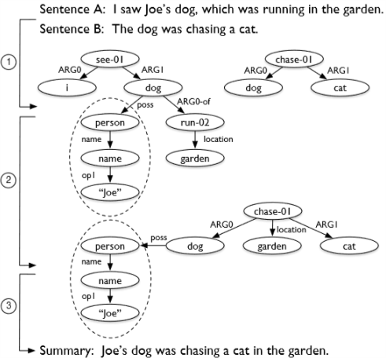

# Toward Abstractive Summarization Using Semantic Representations

> Liu, F. , Flanigan, J. , Thomson, S. , Sadeh, N. , & Smith, N. A. . (2018). Toward abstractive summarization using semantic representations.

## 1 概述

draws on(使用) **Abstract Meaning Representation**([AMR wiki](https://en.wikipedia.org/wiki/Abstract_Meaning_Representation)), Code is available at [github](https://github.com/summarization).

将多个句子的AMR图（表达句子结构）进行合并，然后再根据合并后的图生成新的句子。

例子如图：

整个工作过程分为了三步：

1. 将单独的句子解析为AMR图
2. 将多个句子的AMR图合并为一个总图
3. 最后基于总图生成摘要文本

这篇论文主要研究内容在第二部分。

## 2 前情提要

AMR是有根节点、有向、无环的类似于句子语法结构的的图。具体内容请见参考文献(Banarescu et al., 2013)

第一步将句子解析为AMR，作者使用的是JAMR工具（Flanigan et al., 2014)。

由于需要基于AMR进行对比，所以数据集要求其摘要带有AMR标记信息，AMR Bank的“proxy report”（Knight et al., 2014)被作者选用。**论文作者使用的1.0版本，2017年发布了2.0版本(Knight et al., 2017)**

## 3 综述图的生成

也就是前面说的第二部分，将多个句子的AMR图合并为一个总图，并在总图中提取出一个包含尽可能多信息的子图。分为四部分：Collapsing、Merging、Expansion、Subgraph Prediction

- Collapsing

  类似于取“折叠”之意，将由多个节点构成的命名实体或时间实体看作是一个单独的节点。比如（人A，名字，李四）就是由三个节点构成的命名实体，他就可以被视为一个节点。

- Merging

  在所有句子中，出现的同一个节点（比如李四在两个句子中都出现），都合并为一个节点。同时与他们想关联的边以及标记都连接到这个新的节点上。最后，新建一个新的根节点，并将这个根节点连接到所有句子各自原先的根节点上，将多个句子连接成新的总图。

- Expansion

  每个句子中，添加新的节点给所有可能存在关系的节点对。比如 the dog running in the garden就可以得到the dog is in the garden 的新内容

- Subgraph Prediction

  作者将这个问题看做是一个结构化预测问题，使用$G=(V,E)$表示前面三步得到的图，节点$v\in V$,边$e\in E$ 。求解使下面式子取最大的子图$(V',E')$：
  $$
  score(V',E';\theta,\psi)=\sum_{v\in V'}\theta^\top f(v)+\sum_{e\in E'}\psi^\top g(e)
  $$
  其中$f(v),g(e)$是节点$v$和边$e$的特征表示，$\theta$和$\psi$是这个线性模型的经验化的系数。

  然后使用整数线性规划（ILP）的方式进行子图约束，之后使用支持向量机对上面的系数进行学习，最终可得到提取到的最优的子图。

## 4 文本生成

之前就已经有了基于统计的方法，但是到发文日都没有一个以使用AMR进行机器翻译为目标的系统。所以作者只是使用启发式的方法生成了一个词袋。

## 5 不足

文中提到的不足有：

无法将"Barack Obama"与“Obama”或者“say-01”与“report-01”这样的节点合并，还需要后续的工作对其进行处理。

##  6 参考文献

[1] Banarescu, Laura & Bonial, Claire & Cai, Shu & Georgescu, Madalina & Griffitt, Kira & Hermjakob, Ulf & Knight, Kevin & Koehn, Philipp & Palmer, Martha & Schneider, Nathan. (2013). Abstract Meaning Representation for Sembanking. 178-186. 

[2] Flanigan, J. , Thomson, S. , Carbonell, J. G. , Dyer, C. , & Smith, N. A. . (2014). A discriminative graph-based parser for the abstract meaning representation.

[3] Knight, Kevin, et al. Abstract Meaning Representation (AMR) Annotation Release 1.0 LDC2014T12. Web Download. Philadelphia: Linguistic Data Consortium, 2014.

[4] Knight, Kevin, et al. Abstract Meaning Representation (AMR) Annotation Release 2.0 LDC2017T10. Web Download. Philadelphia: Linguistic Data Consortium, 2017.